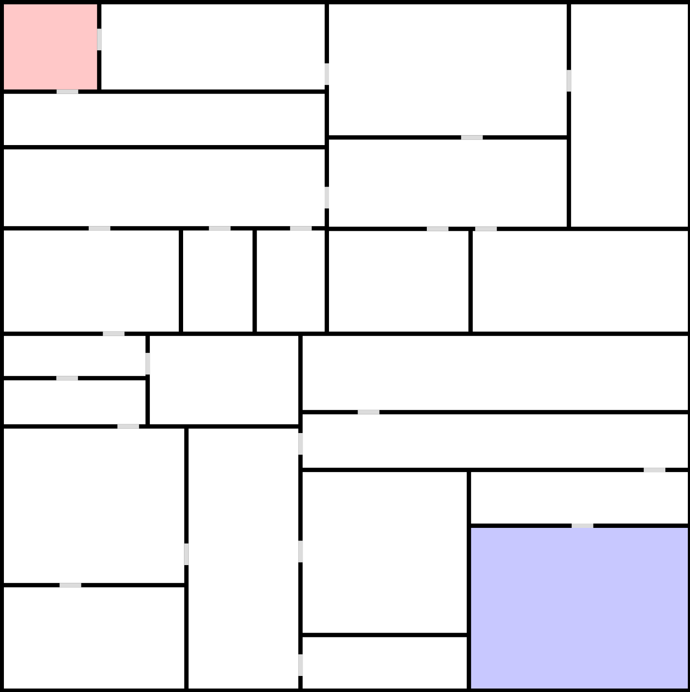

# Procedural Dungeon

An experiment with procedural generation.

## Process
1. Divide a square into two rooms by adding a wall at a random point.
   Recursively divide the new rooms until the desired depth is reached.
1. Starting from the room in the top left corner (the entrance), create a door to each of its unconnected neighbors.
   Repeat for each connected room. This creates a tree structure of rooms.
1. Find the room at the maximum depth (maximum number of rooms between it and the entrance) and label that as the exit.

## Result

